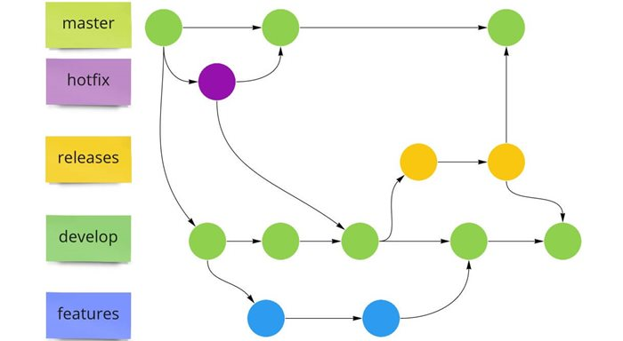

# Taller de git en Github
Este repositorio servirá de guía y apoyo para el taller sobre git y Github a realizarse en el Grupo de Robótica PUCP.

## Contenido

 - [Iniciar un repositorio](https://github.com/MarceJara/TallerGIT#iniciar-un-repositorio)
 - [Configuración de credenciales](https://github.com/MarceJara/TallerGIT#configuraci%C3%B3n-de-credenciales)
 - [Manejo de archivos](https://github.com/MarceJara/TallerGIT#manejo-de-archivos)
 - [Manejo de ramas](https://github.com/MarceJara/TallerGIT#manejo-de-ramas)
 - [Adicionales](https://github.com/MarceJara/TallerGIT#adicionales)
# Iniciar un repositorio
## Creacion de uno nuevo
Inicializando un repositorio.
```bash
  git init
```
Añadir el arichivos del directorio de trabajo al de ensayo(staging).
```bash
  git add . 
```

Commit
```bash
  git commit -M "Primer commit" 
```
Cambiar a la rama main
```bash
  git branch -M main
```
Añadir el arichivos del directorio de trabajo al de ensayo(staging).
```bash
  git remote add origin https://github.com/NOMBRE_USUARIO/NOMBRE_PROYECTO.git
```
Cambiar a la rama main
```bash
  git push -u origin main
```

## Clonacion de uno existente 
```bash
  git clone https://github.com/YOUR-USERNAME/YOUR-REPOSITORY
```

# Configuración de credenciales

Nos podremos identidicar con GIT con los siguientes comandos:

```bash
  #Nombre de usuario con el que GIT te reconocera
  git config --global user.name "Your Name"
  #Correo asociado a tu nomrbe de usuario
  git config --global user.email "your@email.com"
```
# Manejo de ramas

Una vez que sepas manejar los archivos dentro de tu repositorio por tu cuenta, ya podemos avanzar 
a conocer como trabajar en equipo. Las ramas, o *branch* en ingles, son una forma de poder
trabajar un proyecto con otras personas.

Para crear una rama puedes usar el siguiente comando:

```bash
  git checkout -b nombre_rama
```
Luego de crear una rama debemos subirla al repositorio con el siguiente comando:

```bash
  git push --set-upstream origin nombre_rama
```

Asimismo, para cambiar entre ramas se usa el comando:

```bash
  git checkout otro_nombre_rama
```

## [Organización de ramas](https://www.babelgroup.com/es/Media/Blog/Abril-2021/Cinco-Git-Workflows-para-mejores-proyectos)

Existen distintas formas de manejar las organización de las ramas al trabajar en
equipo, a continuación veremos dos tipos:

### Git Flow


### GitHub Flow


# Adicionales
## ¿Quieres evitar que archivos indeseables se suban a tu repositorio?
Usa en tu repositorio un archivo .gitignore
Los archivos de este tipo continen expresiones regulares y formatos de extensiones que harán que git identifique cuales archivos no hacerles seguimiento.

Dependiendo de las herramientas que uses o el lenguaje en el que desarrolles tu proyecto te será muy útil ignorar ciertos archivos. 

La siguiente página web te ayudará brindandote el código si le das el tipo de herramienta que estas usando, por ejemplo, VisualStudio.  https://www.toptal.com/developers/gitignore

Asimismo, deberás ejecutar el siguiente comando para crear el archivo en donde pegarás el código que te brinda la página.

```bash
  touch .gitignore
```
Si deas saber como realizar tus propias expresiones para el archivo .gitignore visita esta [página](https://gist.github.com/jstnlvns/ebaa046fae16543cc9efc7f24bcd0e31)
